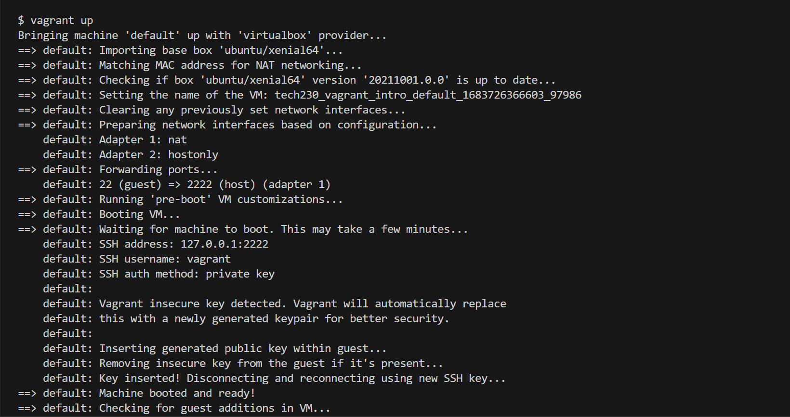

# Sparta app

First we want to get our VM up and running - make sure you are in the right directory, for me it is :
```cd tech230_visualisation/tech230_app_deployment```

Then we create our machine:
```vagrant up```


Next we want to ssh to our machine using:
```vagrant ssh```
.png)

Once you are connected, your input prompt should look like this:
```vagrant@ubuntu-xenial:~$```

Then we cd into our app directory:
```cd app```
it should look like:
```vagrant@ubuntu-xenial:~/app$```

Now we have a few installations to make using the following commands:

```sudo apt-get install nodejs -y``` - nodejs allows you to run javascript on your machine
.png)

```sudo apt-get install python-software-properties``` - Installs python software 
.png)

```curl -sL https://deb.nodesource.com/setup_6.x | sudo -E bash -``` - So, when you run this command, it downloads the shell script from https://deb.nodesource.com/setup_6.x, pipes the output to sudo -E bash, which executes the shell script with administrative privileges. The shell script adds the Node.js repository to the system's package sources, and updates the package cache. this will prompt you to install the latest version of nodejs.
.png)
.png)

run again ```sudo apt-get install nodejs -y```

Next run the command:

```sudo npm install pm2 -g``` - npm: This is the Node Package Manager, a command-line tool that is used to manage and install Node.js packages (libraries or modules).
- pm2: This is a process manager for Node.js applications. It allows you to easily manage and monitor your Node.js processes, including starting, stopping, and reloading them, as well as monitoring their resource usage and logs.
- -g: This is an npm command-line option that tells npm to install the package globally - i.e., not just for the current project, but for the entire system, so that it can be accessed from any directory.
.png)
.png)

And lastly we run the command :

```npm start```

This should get the app running on the nginx webpage. go to the IP:

http://192.168.10.100:300

You should see this:
.png)

Congratulations!